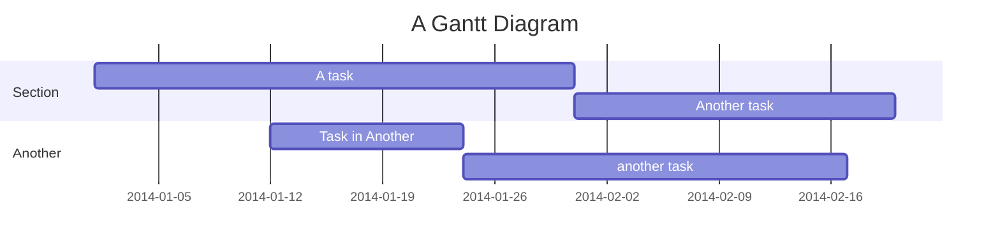

---
{"dg-publish":true,"permalink":"/cemc/sccst-2023/diagrams/","dgHomeLink":false}
---


← [[CEMC/SCCST2023/Theming\|Theming]] | [[CEMC/SCCST2023/Using Custom Domains and Subdomains\|Using Custom Domains and Subdomains]] →

---

# Part 4: Diagrams

## Goals

Learn how to easily create diagrams and flowcharts.

## How to use

Review the [Mermaid documentation](https://mermaid.js.org/syntax/flowchart.html).

Obsidian and the Digital Garden plugin have full support for all Mermaid diagram types.

Mermaid syntax just needs to be wrapped by the following syntax with Obsidian:
   
	```mermaid
	(mermaid diagram syntax goes here)
	```

For example, the following syntax in an Obsidian note:

	```mermaid
	gantt
    title A Gantt Diagram
    dateFormat YYYY-MM-DD
    section Section
        A task          :a1, 2014-01-01, 30d
        Another task    :after a1, 20d
    section Another
        Task in Another :2014-01-12, 12d
        another task    :24d
	```

...produces this diagram:



Try adding that diagram to your note, then publishing it to your course website:


## Conclusion

This concludes part four of the tutorial. You have learned how to embed Mermaid syntax into Obsidian notes to create diagrams, and seen how easy it is to publish those diagrams to your course website.

Next, learn how to publish notes at a [[CEMC/SCCST2023/Using Custom Domains and Subdomains\|custom domain or to use a subdomain]].

---

← [[CEMC/SCCST2023/Theming\|Theming]] | [[CEMC/SCCST2023/Using Custom Domains and Subdomains\|Using Custom Domains and Subdomains]] →

