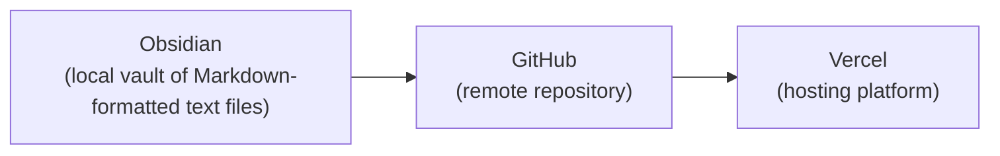

---
{"dg-publish":true,"permalink":"/cemc/sccst-2023/initial-setup/","dgHomeLink":false}
---


[[CEMC/SCCST2023/A Rapid Workflow for Publishing CS Teaching Materials\|🏡 Home]] | [[CEMC/SCCST2023/Theming\|Theming]] → 

---

# Part 1: Initial Setup

## Goals

Create a vault in the [Obsidian](https://obsidian.md/) note-taking software, a repository on [GitHub](https://github.com) for source control, and a website deployment on the [Vercel](https://vercel.com/) hosting platform.



The [Digital Garden plugin](https://dg-docs.ole.dev) is used to commit changes from the local vault in Obsidian to the remote repository on GitHub.

In turn, any changes made to the GitHub repository are deployed on Vercel.

Here is an example of a site built using this workflow:

==**TODO:** Insert link to ICS2O course==

## Steps to Complete

> [!TIP]
> These instructions are a somewhat more detailed version of [those provided](https://dg-docs.ole.dev/getting-started/01-getting-started/)  by the Digital Garden plugin author, [Ole Eskild Steensen](https://ko-fi.com/oleeskild).

1. If necessary, [download and install Obsidian](https://obsidian.md/download).
2. Open Obsidian.
3. Make a new vault.
   
   You may need to select the **File > Open Vault...** menu sequence.
   
   Press the **Create** button.
    
   
   
   Then select an appropriate vault name and a folder to store your vault in:
   
   
   
   > [!NOTE]
> Vaults published through Digital Garden to a website can optionally include built-in site-wide search functionality.
> 
> If you wish to limit search results to those for a specific course, create one vault (and therefore, one website) per course.
> 
> If you do not mind grade 10 students having, for example, the ability to search within grade 11 content, you can use a single vault to publish material for all the courses you teach.
> 
> This tutorial will assume you are using a single vault per course.
> 
> Note that it is possible to create subdomains for each vault you publish. For example, this year, Russell Gordon plans to publish the following sites for use by his students:
> 
> - `icd2o-2023-24.russellgordon.ca`
> - `ics3u-2023-24.russellgordon.ca`
> - `icd4u-2023-24.russellgordon.ca`

4. If desired, adjust the color scheme. Obsidian may default to dark mode.
   
   

5. You will need a GitHub account.
   
   If you do not have one, you can [create a GitHub account here](https://github.com/signup).

6. You will need Vercel account.
   
   If you do not have one, you can [create a Vercel account here](https://vercel.com/signup). 
   
   Indicate that you are working on personal projects when creating your Vercel account. 🤞🏼
   
   
   
   Create your Vercel account using your GitHub credentials:
   
   
   
   When complete you should see something like this:
   
   

7. Open [this template repository](https://github.com/oleeskild/digitalgarden) for a Digital Garden, and click the blue **Deploy to Vercel** button:
   
   
   
   > [!NOTE]
   > You can ignore the green **Use this template** button at the top of the page.
   > 
   > 
   
   When Vercel opens, before selecting the GitHub account, you will need to give Vercel permission to interact with GitHub.
   
   ==**TODO:** See if a screenshot for this step can be obtained on next setup round== 
   
   Once that permission has been granted, select your GitHub username in the **Git Scope** dropdown, and then choose an appropriate name for your repository:
   
   
   
   Then press **Create**.
   
   A minute or so later, you should see something like this:
   
   
   
   > [!IMPORTANT]
   > Keep this page open for future use in this tutorial.
   
    At this point, GitHub can now "speak to" Vercel. 🎉
    
    Visually:
	   
	```mermaid
	flowchart LR
	
	id1["GitHub\n(remote repository)"]
	id2["Vercel\n(hosting platform)"]
	id1 --> id2
	```

8. Next, we install the Digital Garden plugin for use with the vault in Obsidian.
   
   Digital Garden is not authored by the core Obsidian development team. As such, it is classified as a "community" plugin. Therefore we must first make it possible for Obsidian to use third-party plugins:
   
   
   
   Next, browse for, install, and enable the Digital Garden plugin:
   
   
   
9. Now we provide the Digital Garden plugin in Obsidian the information it requires to write changes to the remote repository on GitHub. Visually:   
   ```mermaid
   flowchart LR
   id1["GitHub\n(source control)"]
   id3["Digital Garden\n(Obsidian plugin)"]
   id3 --> id1
   ```   

   Quoting from the plugin author's instructions:
> Create an *access token* to your GitHub Account. This acts as a sort of password so that the plugin can add new notes to your GitHub repository on your behalf. Go to [this page](https://github.com/settings/tokens/new?scopes=repo) while logged in to GitHub. The correct settings should already be applied. (If you don't want to generate this every few months, choose the "No expiration" option.) Click the "Generate token" button, and copy the token you are presented with on the next page.
   
   When creating your token, given it a descriptive name – I choose to enable the "No expiration" option so that I never have to think about this again after setting up a course website:
   
   
   
   Then press the green **Generate Token**:
   
   
   
   On the next page, copy the token to your clipboard:
   
   
   
   Switch to Obsidian, then fill in the:
   
   - repository name you selected earlier
   - your GitHub username
   - the access token (from your clipboard)

   
   
   You have now set up the Digital Garden plugin such that it can communicate with GitHub to upload content that you author.

10. Vercel created a random URL, or website address, to hold the content from your GitHub repository.
    
    One final step is to provide this base URL to the Digital Garden plugin. 
    
    This makes it easier for you to navigate to pages that you author later on. 
    
    Switch to Vercel in your web browser, visit the dashboard, get the base URL, put it in your clipboard, and then paste it into the Digital Garden plugin settings:
    
    
    
11. By default Obsidian "live previews" Markdown content as you type it, and shows the name of the file at the top of a note.
    
    You can optionally disable this behaviour, as shown here:
    
    

12. Next, we'll publish a note!
    
    Add this to the top of your first note:
    
	```
	---
	dg-publish: true
	dg-home: true
	---
	```

	Quoting from the plugin author's tutorial:
	
	> The `dg-home` setting tells the plugin that this should be your *home page* or entry into your digital garden. Therefore, it only needs to be added to one note, not every note you'll publish.
	> 
	> The `dg-publish` setting tells the plugin that this note should be published to your digital garden. Notes without this setting will not be published. In other terms: every note you publish will need this setting.
	
    Now, let's test that the Digital Garden plugin is working correctly to publish a note.
    
    Press `Command-P` on a Mac or `Control-P` on a Windows machine to open the *command palette* in Obsidian. Find the **Digital Garden: Publish Multiple Notes** option, then press the Enter or Return key:
    
    
    
    After a short time, in the bottom right-hand corner of the Obsidian window, you should see a status message indicating that note(s) are being published:
    
    
    
    You can visit your [Vercel dashboard](https://vercel.com/dashboard) to see progress (the deployment should take a matter of seconds).
    
    In Obsidian, open the *command palette* again and find the **Digital Garden: Copy Garden URL** command, then press Enter or Return.
    
    Paste this address into your web browser. You should see the published note:
    
    

## Conclusion

This concludes part one of the tutorial. The publishing workflow has been configured:


In part two of this tutorial series, you will [[CEMC/SCCST2023/Theming\|learn how to select a theme]] in Obsidian and have the Digital Garden plugin apply this theme to your published website.

In part three of the tutorial series, you will learn how to [[CEMC/SCCST2023/Diagrams and Animations\|create diagrams, add screenshots, and insert animations]].

In part four of the tutorial series, you can optionally set up your course websites to be [[CEMC/SCCST2023/Using Custom Domains and Subdomains\|accessed from a custom domain or subdomain]].

---

[[CEMC/SCCST2023/A Rapid Workflow for Publishing CS Teaching Materials\|🏡 Home]] | [[CEMC/SCCST2023/Theming\|Theming]] → 
