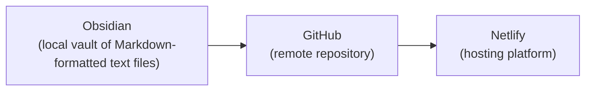

---
{"dg-publish":true,"permalink":"/cemc/sccst-2023/publishing-setup/","dgHomeLink":false}
---


[[CEMC/SCCST2023/A Rapid Workflow for Publishing CS Teaching Materials\|🏡 Home]] | [[CEMC/SCCST2023/Theming\|Theming]] → 

---

# Part 1: Publishing Setup

## Goals

Create a vault in the [Obsidian](https://obsidian.md/) note-taking software, a repository on [GitHub](https://github.com) for source control, and a website deployment on the [Netlify](https://www.netlify.com/) hosting platform.



The [Digital Garden plugin](https://dg-docs.ole.dev) is used to commit changes from the local vault in Obsidian to the remote repository on GitHub.

In turn, any changes made to the GitHub repository are deployed on Netlify.

## Steps to Complete

> [!TIP]
> These instructions are based upon [those provided](https://dg-docs.ole.dev/getting-started/01-getting-started/)  by the Digital Garden plugin author, [Ole Eskild Steensen](https://ko-fi.com/oleeskild).

1. If necessary, [download and install Obsidian](https://obsidian.md/download).
2. Open Obsidian.
3. Make a new vault.
   
   You may need to select the **File > Open Vault...** menu sequence.
   
   Press the **Create** button.
    
   
   
   Select an appropriate vault name and a folder to store your vault in, then press the next **Create** button:
   
   
   
> [!NOTE]
> 
> Vaults published through Digital Garden to a website can optionally include built-in site-wide search functionality.
> 
> If you wish to limit search results to those for a specific course, create one vault (and therefore, one website) per course.
> 
> If you do not mind grade 10 students having, for example, the ability to search within grade 11 content, you can use a single vault to publish material for all the courses you teach.
> 
> This tutorial will assume you are using a single vault per course.
> 
> Note that it is possible to create subdomains for each vault you publish. For example, this year, the author plans to publish the following sites for use by his students:
>  
> - `icd2o-2023-24.russellgordon.ca`
> - `ics3u-2023-24.russellgordon.ca`
> - `ics4u-2023-24.russellgordon.ca`

4. Obsidian may default to using a dark theme. This can be adjusted:
   
   
   
   > [!TIP]
   > 
   > If you are working on Windows, you can access Obsidian settings via the gear icon in the lower left corner of the user interface.
   > 
   > 

5. You will need a [GitHub](https://github.com) account.
   
   If you do not have one, you can [create a GitHub account here](https://github.com/signup).

6. You will need [Netlify](https://www.netlify.com) account.
   
   If you do not have one, you can [create a Netlify account here](https://app.netlify.com/signup) using your GitHub credentials: 
   
   
   
   Provide the requested details to Netlify, and choose **Continue to deploy**:
   
   

   On the next screen, choose to skip deployment of a project (you will do that shortly using a different approach):
   
   
   
   You should see something like this next:
   
   
   
   In the banner at top right, go ahead and select **Not now** – the free tier for a Netlify account is more than sufficient for hosting a course website.

7. Next, follow [this link to clone the Digital Garden repository template and connect your new repository to Netlify](https://app.netlify.com/start/deploy?repository=https://github.com/oleeskild/digitalgarden).
   
   You should see the following screen – click the **Connect to GitHub button**:
   
   
   
   A dialog will appear and you will need to give Netlify permission to interact with your GitHub account.
   
   Once that permission has been granted, provide an appropriate name for your repository, then select **Save & Deploy**:
   
   
   
   In a moment, you should see something like this:
   
   
   
   After a minute or two, you should see a deploy success message – select **Get started**:
   
   
   
   You will be taken to your Netlify team page – select the site that you just created:
   
   
   
   You will arrive at your site overview page – please keep this page open for future use:
   
   
   
   At this point, GitHub can now "speak to" Netlify. 🎉
   
   Visually:
      
	```mermaid
	flowchart LR
	
	id1["GitHub\n(remote repository)"]
	id2["Netlify\n(hosting platform)"]
	id1 --> id2
	```

8. Next, we install the Digital Garden plugin for use with the vault in Obsidian.
   
   Digital Garden is not authored by the core Obsidian development team. As such, it is classified as a "community" plugin. Therefore we must first make it possible for Obsidian to use third-party plugins:

   
   
   Next, browse for, install, and enable the Digital Garden plugin:
   
   
   
9. Now we provide the Digital Garden plugin in Obsidian the information it requires to write changes to the remote repository on GitHub. Visually:   
      ```mermaid
   flowchart LR
   id1["GitHub\n(remote repository)"]
   id3["Obsidian\n(local vault of Markdown-formatted text files)"]
   id3 --> id1
   ```   

   Quoting from the plugin author's instructions:  
   
   > Create an *access token* to your GitHub Account. This acts as a sort of password so that the plugin can add new notes to your GitHub repository on your behalf. Go to [this page](https://github.com/settings/tokens/new?scopes=repo) while logged in to GitHub. The correct settings should already be applied. (If you don't want to generate this every few months, choose the "No expiration" option.) Click the "Generate token" button, and copy the token you are presented with on the next page.
   
   > [!TIP]
   > If you are creating more than one course website site while following these instructions, you can use the same GitHub access token that you created for your first website that was published through the Digital Garden plugin.
   
   When creating your token, given it a descriptive name – I choose to enable the "No expiration" option so that I never have to think about this again after setting up a course website:
   
   
   
   Then press the green **Generate Token**:
   
   
   
   On the next page, copy the token to your clipboard:
   
   
   
   Now switch to Obsidian, select **Obsidian > Settings...** from the menu, then select **Digital Garden** at left, and fill in the:
   
   - repository name you selected earlier
   - your GitHub username
   - the access token (from your clipboard)

   
   
   You have now set up the Digital Garden plugin such that it can communicate with GitHub to upload content that you author.

10. Netlify created a random URL, or website address, to hold the content from your GitHub repository.
    
    One final step is to provide this base URL to the Digital Garden plugin. 
    
    This makes it easier for you to navigate to pages that you author later on. 
    
    Switch to Netlify in your web browser, visit the dashboard, get the base URL, put it in your clipboard, and then paste it into the Digital Garden plugin settings:
    
    

11. It's time to create a new note. Try creating a note, like this:
    
    
    
    Notice how Obsidian converts Markdown to regular text as you type the header. As well, the name of a note appears inline at the top of that note.
    
    This behaviour can be optionally disabled – see the next step.
    
12. By default Obsidian "live previews" Markdown content as you type it, and shows the name of the file at the top of a note.
    
    You can optionally disable this behaviour, as shown here – and then toggle reading mode on and off using the `Command-E` or `Control-E` keyboard shortcuts:
    
    

13. Now we are ready to publish this note – Digital Garden commits the changes to GitHub – and in turn, a deployment on Netlify is triggered to update the public website.
    
    Add this text to the top of your first note:
    
	```
	---
	dg-publish: true
	dg-home: true
	---
	```
	
	Like this:
	
	
	
	Quoting from the plugin author's tutorial:
	
	> The `dg-home` setting tells the plugin that this should be your *home page* or entry into your digital garden. Therefore, it only needs to be added to one note, not every note you'll publish.
	> 
	> The `dg-publish` setting tells the plugin that this note should be published to your digital garden. Notes without this setting will not be published. In other terms: every note you publish will need this setting.
	
    Now, let's test that the Digital Garden plugin is working correctly to publish a note.
    
    Press `Command-P` on a Mac or `Control-P` on a Windows machine to open the *command palette* in Obsidian. Find the **Digital Garden: Publish Multiple Notes** option, then press the Enter or Return key:
    
    
    
    After a short time, in the bottom right-hand corner of the Obsidian window, you should see a status message indicating that note(s) are being published:
    
    
    
    You can visit your Netlify dashboard to see progress (the deployment should take a matter of seconds).
    
    If for some reason your site has not deployed – this should happen automatically after the GitHub repository is updated – you can trigger a deploy manually:
    
    
    
    Now in Obsidian, open the *command palette* again and find the **Digital Garden: Copy Garden URL** command, then press Enter or Return:
    
    
    
    Paste the address into your web browser. You should see the published note:
    
    
    

## Conclusion

This concludes part one of the tutorial. The publishing workflow has been configured:


Next, [[CEMC/SCCST2023/Theming\|learn how to select a theme]] in Obsidian and have the Digital Garden plugin apply this theme to your published website.

---

[[CEMC/SCCST2023/A Rapid Workflow for Publishing CS Teaching Materials\|🏡 Home]] | [[CEMC/SCCST2023/Theming\|Theming]] → 
