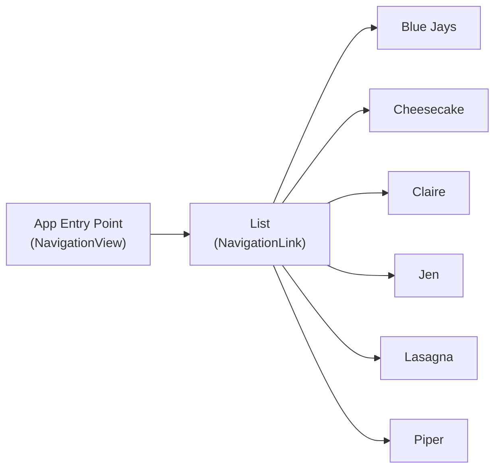

---
{"dg-publish":true,"permalink":"/cemc/sccst-2023/slides/","dgHomeLink":false}
---

### A Rapid Workflow for Publishing CS Teaching Materials

Russell Gordon
<small>Lakefield College School</small>

---

###  Motivation

Avoid fiddling with page layout or slides.

---

###  Motivation

Satisfy 80/20 rule.

---

###  Motivation

Meet the needs of English language learners.

---

### Benefits

Diagrams and flowcharts using Mermaid.

---

### Benefits

Add images quickly by drag and drop.

---

### Benefits

Use animations to convey key concepts without distraction.

---

### Benefits

Focus on content, not presentation, by writing [in Markdown](https://help.obsidian.md/Editing+and+formatting/Basic+formatting+syntax).

---

### Benefits

Your data is stored in plain text files – less potential for lock-in.

---

### Benefits

Link quickly to existing content.

---

### Benefits

Publish a searchable site.

<< Show search with Digital Garden >>

---

### Benefits

Free hosting (at [Netlify](https://www.netlify.com/) or [Vercel](https://vercel.com/)).

---

### Drawbacks

Dependencies on:

- [Obsidian](https://obsidian.md)
- [Digital Garden](https://dg-docs.ole.dev) plugin.
- [GitHub](https://github.com)
- [Netlify](https://www.netlify.com) or [Vercel](https://vercel.com)

