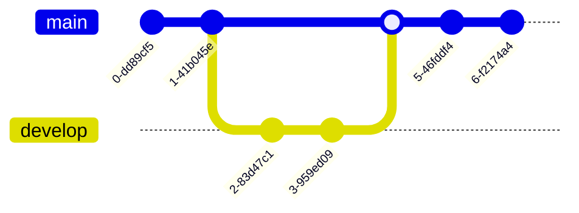

---
{"dg-publish":true,"permalink":"/cemc/sccst-2023/slides/","dgHomeLink":false}
---


[[CEMC/SCCST2023/A Rapid Workflow for Publishing CS Teaching Materials\|🏡 Home]]

---


<div class="transclusion internal-embed is-loaded"><div class="markdown-embed">


### A Rapid Workflow for Publishing CS Teaching Materials

Russell Gordon
<small>Lakefield College School</small>

---

###  Motivation

Avoid fiddling with GUI-based page layout, slides, and diagramming software.

---

###  Motivation

Satisfy 80/20 rule.

---

###  Motivation

Meet the needs of English language learners.


---

### Benefits

Syntax-highlighted code blocks for most languages.

```python
# Greet the world using a function in Python
def hello_world():
  return "Hello, world!"
```

---

### Benefits

Math notation using LaTeX: single-line.

$x=\frac{-b \pm\sqrt{b^2-4ac}}{2a}$

---

### Benefits

Math notation using LaTeX: multi-line.

$
\begin{aligned}
a &= -0.25 \\
b &= 2 \\
c &= 1.5
\end{aligned}
$

---

### Benefits

Mermaid: left-right [flowchart](https://mermaid.js.org/syntax/flowchart.html).


---

### Benefits

Mermaid: top-down [flowchart](https://mermaid.js.org/syntax/flowchart.html).


---

### Benefits

Mermaid: [sequence](https://mermaid.js.org/syntax/sequenceDiagram.html) diagram.


---

### Benefits

Mermaid: [class](https://mermaid.js.org/syntax/classDiagram.html) diagram.


---

### Benefits

Mermaid: [state](https://mermaid.js.org/syntax/stateDiagram.html) diagram.


---

### Benefits

Mermaid: [entity-relationship](https://mermaid.js.org/syntax/entityRelationshipDiagram.html) diagram.


---

### Benefits

Mermaid: [user journey](https://mermaid.js.org/syntax/userJourney.html) diagrams.


---

### Benefits

Mermaid: [Gantt](https://mermaid.js.org/syntax/gantt.html) charts.


---

### Benefits

Mermaid: [pie](https://mermaid.js.org/syntax/pie.html) charts.


---

### Benefits

Mermaid: [git graph](https://mermaid.js.org/syntax/gitgraph.html) diagrams.



---

### Benefits

Add images quickly by drag and drop.


---

### Benefits

Use animations to convey key concepts without distraction.


---

### Benefits

Focus on content, not presentation, by writing [in Markdown](https://help.obsidian.md/Editing+and+formatting/Basic+formatting+syntax).

---

### Benefits

Your data is stored in plain text files – less potential for lock-in.

---

### Benefits

Link quickly to existing content.


---

### Benefits

Publish a searchable site.


---

### Benefits

Free hosting (at [Netlify](https://www.netlify.com/) or [Vercel](https://vercel.com/)).

---

### Drawbacks

Dependencies on:

- [Obsidian](https://obsidian.md)
- [Digital Garden](https://dg-docs.ole.dev) plugin.
- [GitHub](https://github.com)
- [Netlify](https://www.netlify.com) or [Vercel](https://vercel.com)

---

### Personal Conclusion

Benefits outweigh potential for software failure.

Better than manually writing HTML, using a word processor, or a proprietary content management system.


</div></div>
