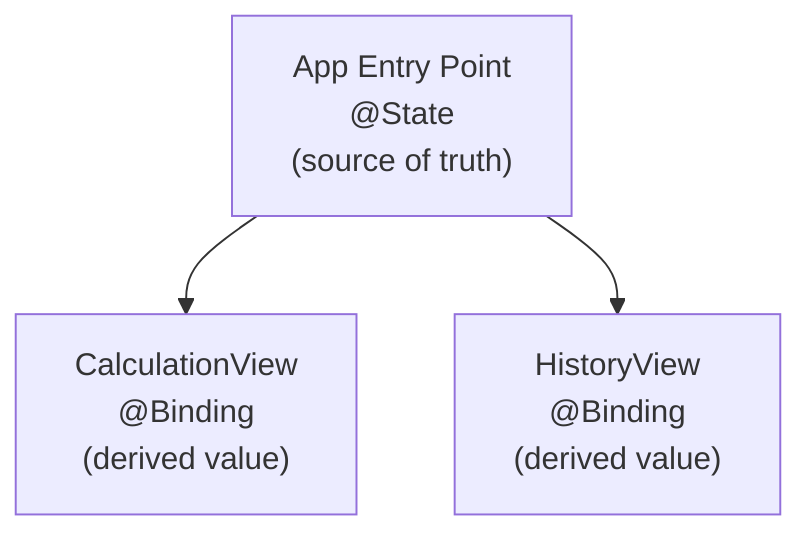

---
{"dg-publish":true,"permalink":"/current-courses/grade-11-introduction-to-computer-science/recaps/thread-2-interactive-apps/","dgHomeLink":false}
---

# Thread 2 Recap

## Table of Contents

- [[Current Courses/Grade 11 Introduction to Computer Science/Recaps/Thread 2 - Interactive Apps#Interactive Apps\|Interactive Apps]]
	- [[Current Courses/Grade 11 Introduction to Computer Science/Recaps/Thread 2 - Interactive Apps#Interactive Apps\|Background]]
	- [[Current Courses/Grade 11 Introduction to Computer Science/Recaps/Thread 2 - Interactive Apps#Interactive Apps\|SwiftUI and Structures]]
	- [[Current Courses/Grade 11 Introduction to Computer Science/Recaps/Thread 2 - Interactive Apps#Interactive Apps\|Property Wrappers]]
		- [[Current Courses/Grade 11 Introduction to Computer Science/Recaps/Thread 2 - Interactive Apps#Property Wrappers\|@State]]
		- [[Current Courses/Grade 11 Introduction to Computer Science/Recaps/Thread 2 - Interactive Apps#Property Wrappers\|@Binding]]
		- [[Current Courses/Grade 11 Introduction to Computer Science/Recaps/Thread 2 - Interactive Apps#Property Wrappers\|Deciding what property wrapper to use]]

## Interactive Apps

### Background

[UIKit](https://code.tutsplus.com/tutorials/ios-from-scratch-with-swift-first-steps-with-uikit--cms-25461) remains a framework that is actively supported by Apple – together with Interface Builder and storyboards – you can use UIKit to author an app in Swift and describe a user interface.

While UIKit is powerful, and allows for a lot of customization, it can also be cumbersome. It is an *imperative* framework. You must use Swift code to tell UIKit exactly *how* to do something. Simply setting up a text field to receive user input, act on that input, and then show some output requires manual effort on your part as the programmer.

By comparison, SwiftUI removes the need for a lot of this manual effort. It is a *declarative* framework. You use Swift code to tell SwiftUI *what* you want, and the framework figures out the details of how to do what you ask for behind the scenes, automatically.

While a drawback of SwiftUI is that its user interfaces are, to some extent, less customizable than a user interface expressed with UIKit... writing an app using SwiftUI is *much* faster.

<small>[[Current Courses/Grade 11 Introduction to Computer Science/Recaps/Thread 2 - Interactive Apps#Thread 2 Recap\|Back to top ⬆]]</small>

### SwiftUI and Structures

As we [[Current Courses/Grade 11 Introduction to Computer Science/Recaps/Thread 1 - Structures#Describing User Interfaces\|learned in the thread 1 of this course]], we use structures to describe the content of a user interface.

When a structure is used to describe a user interface with SwiftUI, it must conform to the `View` protocol.

A structure that conforms to the `View` protocol must contain a property named `body`.

The `body` property must return an instance of a single structure that also conforms to the `View` protocol.

> [!NOTE]
> To save time, structures that conform to the `View` protocol are generically referred to as "a view" – something that that user sees in an app's interface and interacts with.

Here, the `body` property of `ContentView` returns a single instance of the `Text` structure:

Normally, we omit the `return` keyword for brevity:

At first look, it would seem that a framework where we can only return a single structure, or *view*, is not very useful.

How could we possibly express an entire user interface with one view?

The answer is that *we can embed multiple views inside a single view*.

Here, we prepare to return an instance of a `VStack` structure instead:

To create an instance of a `VStack`, an *argument* must be provided for the `content` *parameter*.

In other words, we must provide an answer for the question the `VStack` is asking, namely: "What content do you want me to show?"

Here, we answer that question by saying: "Display these two bits of text..."

And in so doing, we are now using three views – first, a `VStack`, which in turn contains two `Text` views.

However, the syntax is a bit cumbersome.

A `VStack` structure always asks for its `content` as the final parameter:

As a convenience, the Swift programming language allows us to provide the argument for the final parameter as a *trailing closure* instead:

And this syntax is much cleaner.

Of course, from there, we learned that we can:

1. embed all sorts of views within one another, to express more complex user interfaces
2. use view modifiers to further change the appearance of a view

Allowing us to create interfaces that look like this:

But, how did we make an app *interactive*? How did we make an app accept input, act upon it, and show output?

<small>[[Current Courses/Grade 11 Introduction to Computer Science/Recaps/Thread 2 - Interactive Apps#Thread 2 Recap\|Back to top ⬆]]</small>

### Property Wrappers

#### @State

A structure can contain both stored properties and [[Current Courses/Grade 11 Introduction to Computer Science/Recaps/Thread 1 - Structures#Computed properties\|computed properties]].

Stored properties can be marked with various property wrappers.

We use the `@State` property wrapper to indicate to SwiftUI that when the contents of the property change, the user interface should be updated. 

A *binding* must be created between the `Slider` view and the property – the shorthand syntax used to express that binding is the `$` symbol:

Now, as the slider is dragged, the value inside the `percentage` property is automatically updated.

And if we add a `Text` view that displays the value of the `percentage` property, the `Text` view gets updated, too:

This *automatic update* of the user interface when the state (data) inside a structure changes is what makes SwiftUI such a powerful and fast framework for app development.

<small>[[Current Courses/Grade 11 Introduction to Computer Science/Recaps/Thread 2 - Interactive Apps#Thread 2 Recap\|Back to top ⬆]]</small>

#### @Binding

As the year continued, we learned how to build apps that share data between screens, or views within the app.

For example, the [**Share the Bill** app](https://github.com/lcs-rgordon/ShareTheBill) allowed the user to determine how to split a bill within `CalculationView`:

And then on `HistoryView`, you could view see *same data*, but presented with a different visual appearance:

In **Share the Bill**, a [[Current Courses/Grade 11 Introduction to Computer Science/Concepts/Lists\|list]] was used to store the history of bill calculations.

The source of truth – or place where that history was initialized – was at the app entry point of the **Share the Bill** app.

The two views shown above – `CalculationView` and `HistoryView` – used a *reference* to the source of truth.

That reference was established by using the `@Binding` property wrapper.

We call such references *derived values*:

The `history` property on line 27 in `CalculationView` is a derived value:

The `history` property on line 24 in `HistoryView` is also a derived value:

<small>[[Current Courses/Grade 11 Introduction to Computer Science/Recaps/Thread 2 - Interactive Apps#Thread 2 Recap\|Back to top ⬆]]</small>

#### Deciding what property wrapper to use
When you create a view that has stored properties, you need to ask yourself several questions.

1. Where does the data originate?

If the data originates on that view, it is the source of truth. Use `@State`.

If the data does *not* originate on that view, next ask yourself:

2. Does the data need to be changed, or modified, on this view?

If the data does not need to be changed, declare it as a regular property using the `let` keyword.

If the data *does* need to be changed (but it did not originate on the view) then it is a derived value. Use `@Binding`.

All of this can be summarized by the following flowchart:

<small>[[Current Courses/Grade 11 Introduction to Computer Science/Recaps/Thread 2 - Interactive Apps#Thread 2 Recap\|Back to top ⬆]]</small>
