---
{"dg-publish":true,"permalink":"/current-courses/grade-11-introduction-to-computer-science/topics/databases/making-a-todo-list-app-part-4/","dgHomeLink":false}
---

# Making a To-do List App (Part 4)

This is part 4 of a tutorial on how to create a to-do list app backed by a database. You [[Current Courses/Grade 11 Introduction to Computer Science/Topics/Databases/Making a Todo List App, Part 3\|can access part 3 of the tutorial here]]. 

In this final part of the tutorial, you will learn how to add search to the to-do list.

## Simplest possible example

Before looking at how to do this with a database in the context of our to-do list app, let's look at a simpler example.

You are encouraged to make a new project and follow along with this simplified example.

### A scrollable list based on an array

Here we present the user interface of a scrollable list whose items are provided by an array of strings:


### Adding .searchable

The `.searchable` view modifier accepts a binding to a string and presents a search field.

When the user types into the search field, the string the search bar is bound to will be updated by SwiftUI.

Make the following edits:


If you make those edits, you will note that a search bar does *not* appear. That is because `.searchable` only works when it is attached to a `List` that is embedded within a `NavigationView`.

So, make the following additional edit to place the list inside a `NavigationView` structure:


The search bar is now visible. 

However, if you now go ahead and type something into the search bar, you will notice that the list is not yet filtered based on the input given.

Remember, the `.searchable` view modifier just provides the user interface of the search field, and then updates the property it is bound to – in our case, `searchText` – when the user types something.

It is up to us to actually *use* what is placed inside of the `searchText` property by performing a search and filtering the list.

### Showing the search text

Before writing the search code, let's get a look at what the user is typing into the search field. 

Make the following edits to add a `Text` structure above the list, within a `VStack`:


After making the edits, if you then type something into the search field, you should see what you typed in to the search field shown in the `Text` view that we added above the `List`.

We are now ready to perform the actual search.

### Linear Search

The Swift programming language provides built-in search and filtering for arrays.

However, we are going to implement our search manually. 

We will learn how to do a basic *linear search* right here in this tutorial, right now.

Here is how our search algorithm will work:

- when the search term is an empty string...
	- return the original array
- given a search term...
	- create a new array with no elements in it
	- iterate over the original array
		- compare the search term to the current item in the original array
			- when the current item contains the search term, add it to the new array
	- return the new array, which will contain only the elements that have some text matching the search term

Here is what that looks like in practice – we implement the search within a *computed property* – and on line 57 we modify our `List` structure to use whatever is returned from our new computed property:


Here is an animation showing all of this in action, as we search for items containing the text `3`:


So, our search works great with the numeric parts of each item. 😎

### Case sensitive vs. case-insensitive search

However, try typing the text `Tem` into the search field of your app.

All elements in the list disappear.

This occurs because the search is *case-sensitive*.

This means that although all the elements in our list contain the string `tem` they do not match the search term `Tem` because a capital `T` is not the same thing as a lowercase `t`.

We can fix this by making the following edit on line 36 – note that the new code is highlighted in blue, and the old code is shown below in grey:


If you now try searching for `Tem` you will notice that *all* items remain in the list, because the search is now case-insensitive.

*Every* element in the list contains the text `tem` and when performing a case-insensitive search, `tem` is considered a match for `Tem`.

Note that case insensitive searching is the norm in most apps, which is why we've taken the time to look at this.

This completes the simplest possible example of adding search to a list. If you want to review all the commits made to complete this example, you can [see the list of commits here](https://github.com/lcs-rgordon/SearchList/commits/main).

## Searching and filtering within a database table

Now that we've looked at the simplest possible example of searching for items within a list in SwiftUI, let's review the raw SQL required to filter rows that are shown within a table in the database.

We can find *all* the rows in our database table with the following query:


To search or filter rows, we add a `WHERE` clause and use the `LIKE` keyword together with the `%` wildcard that matches any character:


You should observe several important things:

1. **Make dinner** is included because it contains an `n`
2. **Get up early & go for a run** is included because it contains an `n` even though the `n` is the final character
3. **Nap later on** is included even though `N` is not the same as `n`; recall that the SQLite by default performs a case-insensitive search.

Note what happens if the query is modified so that there are *no characters* betweeen the `%` wildcards:


*All* of the rows are returned. Two `%` wildcards with no other characters in-between will match *any* string, so all rows are returned by the query.

So... our job with the to-do list app will be to use the `.searchable` modifier in SwiftUI to add a `WHERE` clause to our existing `SELECT` statement.

## Current state of the to-do list app

Here is where things should be in your to-do list app:


We have just added the ability to delete items using the `.onDelete` view modifier on line 82. That invokes the `removeRows` function that begins on line 93:


The `removeRows` function runs a query against the database to delete items from the list – all of this was explained in [[Current Courses/Grade 11 Introduction to Computer Science/Topics/Databases/Making a Todo List App, Part 3\|part 3 of this tutorial series]].

Before you continue, make sure that your to-do list app can:

- read to-do items from the database
- add new items to the database
- mark items as being completed
- delete items from the list

## Add the search bar

The first step is to add the search bar to the user interface.

Here is the current code in `ListView`, with the following code blocks folded up:

- `HStack` that provides the UI to add an item
-  the `List` 
- the `removeRows` function


Make the following two edits to add the search bar:


We have:

1. Added a property to hold the current search text.
2. Added the `.searchable` view modifier so that we get the search bar user interface; it is bound to the `$searchText` property.

Of course, if we type in the search bar, nothing happens, because we have not implemented the actual search yet.

## Add the WHERE clause

Recall that the raw SQL to perform a search and filter rows is quite simple:

```sql
SELECT *
FROM TodoItem
WHERE description LIKE '%n%'
```

In this case, the user is searching for items that contain the text `n`.

More generally, we want to use a `WHERE` clause with the `LIKE` keyword, inserting whatever the user searches for between the `%` wildcard characters.

We might think that we can do this by adding just one line of code to the definition of the `todoItems` stored property:


Here, our property marked with `@BlackbirdLiveModels` is updated. We haved added the `sqlWhere` parameter and provided an argument that will produce the SQL we need.

For example, say that the user typed **Go** into the search field.

The code on line 21 in the screenshot above would send the following `WHERE` clause  to the database:

```sql
WHERE description LIKE '%Go%'
```

If the user typed **for** into the search field, this `WHERE` clause would be sent to the database:

```sql
WHERE description LIKE '%for%'
```

The code we have added on line 21 *is* correct, but where we have placed it is not.

We have to fix a problem with how our `ListView` structure is defined.

You will note that the following error has shown up:


So what does this error mean?

	Instance member 'searchText' cannot be used on type 'ListView'; did you mean to use a value of this type instead?

It means that `searchText` is a stored property of `ListView`, the same way that `todoItems` is *also* a stored property of `ListView`.

Think wayyy back to the start of this year when we created simple structures that looked like this:


We'd create an instance of such a structure like this:


Remember, each stored property:

- name
- hairColor
- age
- heightInCentimetres
- massInKilograms

... becomes a parameter (question) for which we must supply an argument (answer) when we want to create an instance of the structure.

So, the reason that we get this error in `ListView`:


... is because *one stored property cannot be used to define another stored property*.

It would be as if we tried to write code that looks like this:


Aside from not making any sense – a person's name has nothing to do with their hair colour – it's just not allowed by the Swift programming language.

We cannot use the stored property `name` to define the stored property `hairColor`.

In our current project, we cannot use `searchText` to define `todoItems`.

*One stored property cannot be defined by another.*

So, how do we fix this?

## Apply abstraction

It turns out that if we *separate our concerns* a little bit, we can work around the limitation described above.

We will break `ListView` up into two separate structures:

1. We will keep our stored property named `searchText` on `ListView`. It will be populated by the `.searchable` view modifier.
2. We will create a new helper structure called `ListItemsView`. It will accept a parameter named `filteredOn` whose value will be used to create the stored property named `todoItems`. We use that to show the list of to-do items, as usual.
   
In short, one stored property cannot be defined by another stored property *within the same structure*.

However, if we *separate* the structure into two different structures, we can pass a message (what we want to filter on) from one structure to the new helper structure – and then we are good to go!

Here's a picture of the approach we will take:

```mermaid
flowchart TD

id1["App Entry Point\n(TodoListApp)"] --> id2["ListView\n∙ defines searchText"]
id2 --> id3["ListItemsView\n∙ receives copy of `searchText` via `filteredOn` parameter\n∙  defines `todoItems`"]
```


Now let's make the edits.

Begin by making a new **SwiftUI View** in the Views group named `ListItemsView`:


At this point, although we do not have code that is functional, commit your work – it will make it easier to see changes you need to make in the following steps.

Use this message when you commit:

```
Started to separate ListView and ListItemsView to allow search to work...
```

Now import the Blackbird framework and then add a stored property to pull a reference to the database from the environment, like this – note the blue bars at right where code was added:


Scroll the code in `ListView` up a bit, and if you haven't already, use code folding to collapse the `HStack` used to add new items, and the `List` as well:


Then, highlight the collapsed `List` at left in `ListView`, press **Command-X** to cut it, and then replace the `Text` structure at right in `ListItemsView` using **Command-V**:


You will see some errors appear after completing that change. Do not worry:


Use code folding to collapse the `List` at right:


Next you are going to move the `removeRows` function out of `ListView` and into `ListItemsView` using the same cut and paste approach:


Then, collapse the `removeRows` function at right using code folding. Things will look something like this:


Essentially, we have moved the scrollable list and everything that is related to it out of `ListView` and into `ListItemsView`.

All that remains is to get `todoItems` into `ListItemsView`.

How we do that will require a special kind of function, called an *initializer*.

Let's begin by moving the `todoItems` property from `ListView` into `ListItemsView`:


After moving the property into the new file, you can see that we are left with an error – we need `searchText` to build the query that uses the `WHERE` clause to filter the rows returned from the database table.

The initializer is what will allow us to pass `searchText` from `ListView` to `ListItemsView` and resolve all of these errors.

If feels a bit wrong to do so at this point, but please commit your work, so it is easier for you to see that you have made the next couple of edits correctly.

Commit your work with this message:

```
Almost finished separating ListView and ListItemsView to allow search to work. About to add the initializer function.
```

Then, add the following code after the computed properties section and before the functions section of `ListItemsView` – note the vertical blue bar where code was added:


With that edit, we are saying:

"To create an instance of `ListItemsView` you must provide an argument for the parameter `filteredOn`."

So, let's do that – in `ListView` at left, we have removed the list code. We will replace it with one line of code to create an instance of `ListItemsView` – look for the vertical blue bar on line 55:


When the instance of `ListItemsView` is created, it asks the question "Filtering on what?" by requiring us to fill something in for the `filteredOn` parameter. We answer the question as follows: "Based upon the current search text!" We provide the answer by supplying `searchText`  as the argument.

Over at right inside the initializer in `ListItemsView`, the value provided at left from `ListView` is available to us inside the initializer. 

We will make our final set of edits now to `ListItemView` to use that value.

Here is animation showing you how to make the edit, as it can be a bit tricky to do, and the syntax is new:


The code should look like this now:


Let's review what has been done here:

1. In `ListView`, we create an instance of `ListItemView` and pass in whatever the user is searching for.
2. An *initializer* is a special function that is run immediately when an instance of a structure is being created, and before anything else happens. Within the `ListItemView` initializer, we receive the search text via the `filteredOn` parameter. 
3. Here, we are saying that we will have a property named `todoItems` but we do not give it a value directly. Rather, we will let the initializer do that work for us.
4. Finally, inside the initializer, we assign a value to `todoItems` using the search text received from `ListView`. We are *initializing* the `todoItems` property. Importantly – we are not using one property to intialize a different property. Instead, we are receiving a copy of the search text as an argument provided to the intializer, and using that to set up the `todoItems` property. This is how we avoid the problem we encountered earlier – where Swift does not allow us to define one property within a structure using another property.

There is one last edit to make. To try out our new `ListItemsView` in the preview window, we need to make the live view have access to the database, and provide an argument to the `filteredOn` parameter.

You can do that like this:


At first, you may think that the filtering is not working. However, as the "search" text gets smaller – as characters are removed from the argument provided to the `filteredOn` parameter – you can see that more items in the list match.

When the argument to `filteredOn` becomes an empty string, you can see that *all* items in the list are returned, since there is no filter being applied.

Finally, if we run a preview from the `ListView` structure, we can see everything working together:


You may optionally choose to move the UI that allows for adding an item to the bottom of the interface – I prefer this because adding items is something the user will do frequently – and this puts that part of the user interface within closer reach of their thumb when holding their phone with one hand:


Whew! You are done! 🎉 Good work. 

## Exercise

Try adding search functionality to your **Mood Mapper** app, or to your end-of-module 2 app if you chose to work on that last week instead.