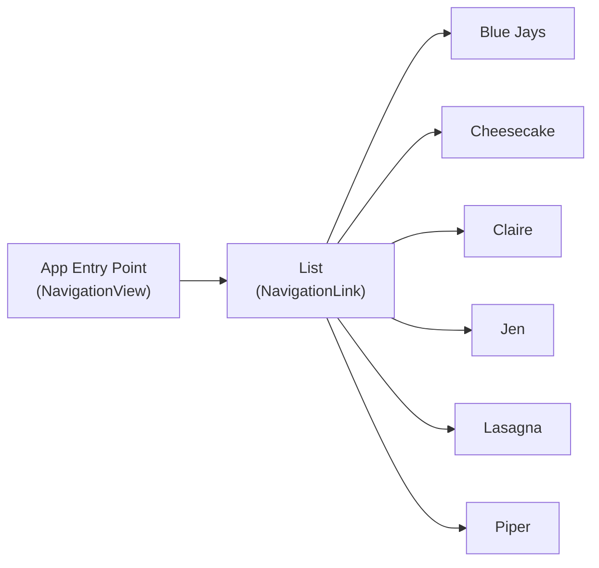
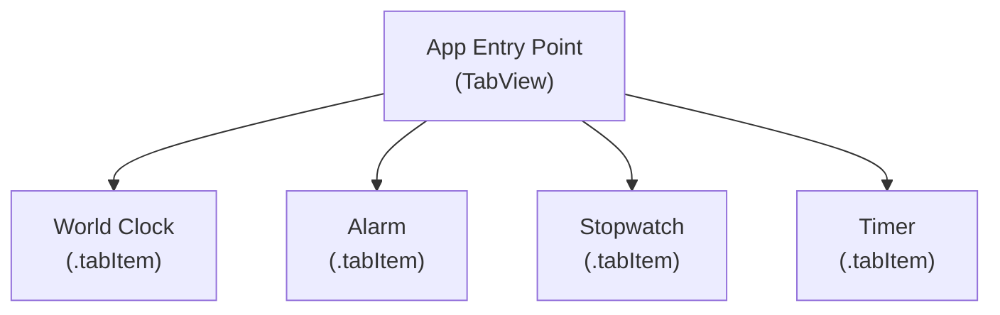
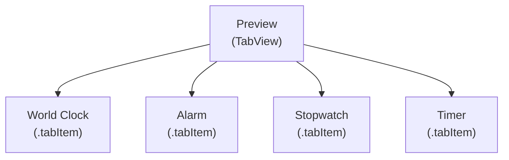

---
{"dg-publish":true,"permalink":"/current-courses/grade-11-introduction-to-computer-science/topics/swift-ui/reproducing-the-digital-stopwatch-interface-part-2/","dgHomeLink":false}
---

# Reproducing the Digital Stopwatch Interface, Part 2

## Fixing the Colors

We've made great progress:


... but the colors of the buttons don't match our goal:


Let's fix that now.

Press `Command-Spacebar` to open the Spotlight search bar:


Then type:

	digital

...and the first suggestion should be an app named **Digital Color Meter**:


Press the **Return** key and the application will open:


As you move the mouse cursor around the user interface on your computer, the app will tell you the color values of the pixel that is right underneath your mouse cursor.

How computers describe color could be a topic for an entire course!

Here is a brief explanation.

**Digital Color Meter** defaults to describing colours with three *channels* – red, green, and blue.

For example, if a color has 0 for it's red channel, 0 for it's green channel, and 0 for it's blue channel, then you will have black.

For short, we would say that black has RGB values of 0, 0, 0.

Each color channel in RGB is an 8-bit value (more on what a *bit* is later in this course).

For now, know that 8 bits allows for a number between 0 and 255 to be represented.

So, what color would have RGB values of 255, 255, 255?

If you guessed "white", you are correct.

Every other color is some other combination of RGB values.

For example, a shade of purple has RGB values of 166, 128, 223.

So, we are going to:

1. Use **Digital Color Meter** to find the RGB values for the buttons from the interface we are trying to reproduce.
2. Create a *custom color set* in Xcode to duplicate that color.
3. Use the custom color in our own version of the Stopwatch app.

### Finding a Color

To find a color:

- Scroll to a part of this article where our goal is shown, such as the very top.
- Use the keyboard shortcut `Command-Tab` to switch to **Digital Color Meter**.
- Change the dropdown menu in **Digital Color Meter** so that the **Display in sRGB** option is shown.
- Then, hover your mouse cursor over the button on the left.
- Finally, when your mouse cursor is in the correct position, use the keyboard shortcut `Command-L` to *lock* **Digital Color Meter** so that it keeps showing the same RGB values – even after you move your cursor away to another position.

That's a lot of steps, so here's what that looks like in a short animation:


Now you know that the RGB color code for the dark grey of the button of our goal is: 51, 51, 51.

### Creating a Custom Color Set

Your Xcode interface probably looks like this right now:


We're going to re-arrange things so that it looks like this instead – `ContentView` on the left, and the **Assets** folder for our project on the right:


Here's how to do that:


Next, we will:
- Create the new color set named `Dark Grey` in the **Assets** folder
- Assign it the RGB values of 51, 51, and 51
- Ensure that the same color appears for this color set with *any* appearance on a user's device (even when the device is in dark mode)
	- We do this by copying, or `Option`-dragging from the color well on the left into the color well on the right

Here is what that looks like:


Finally, we can use the new color set that we have just defined within our project's code.

Make the following edit to ContentView – changing the argument for `buttonColor` from the built-in system `.gray` color to `Color("Dark Grey")`:


It's quite likely that the preview window will stop working when you change the argument to it's new value.

After making certain that the argument is `Color("Dark Grey")` – check for typos – you can restart the preview window using the keyboard shortcut `Option-Command-P`.

You will see the lefthand button now has a darker grey – that should perfectly match the dark grey of the our goal:


How can you check? Use the **Digital Color Meter** app, of course!

Press `Command-L` to unlock the value showed by **Digital Color Meter** and then check the RGB values for the button from our app at left:


And do the same for the buttom from our goal, at right:


#### Mini-Exercise: Fix the other button

Now it's your turn!

Use the steps shown in the most recent section of this lesson to create another color set named `Dark Green` and then use it to change the color of the righthand button.

When you are done, things should look like this:


This is *huge* progress, and you've learned a lot about how to use Xcode to represent precise colors.

Well done!

Commit and push your work with this message:

```
Created and used new color sets to match buttons to our goal.
```
## Adding the Tab Bar

The next section we'll tackle is adding the tabs at the bottom of the interface:


This is reasonably straightforward.

Tabs are created in SwiftUI using a `TabView` structure.

So, how does a `TabView` work?

To answer that question, let's revisit something you already understand – a navigation view:


The `NavigationView` structure is essentially a container for moving *horizontally* between screens in your app:



Think of a `TabView` structure as a container for moving between screens in a vertical manner, since we select the new screen by tapping at the *bottom* of the current screen:


First we create a `TabView`, then we identify the structures that a user can navigate to – attaching a `.tabItem` view modifier to identify what *image* and *text* should appear for each option, or item, in the tab bar:



This is generally how a `TabView` is used when authoring a finished app – you would place the `TabView` in the app entry point file:


> [!TIP]
> Don't actually make this edit in your project yet – we're going to put the `TabView` somewhere else in a moment.

After modifying the code in the app entry point file, when you launch your program in the **Simulator**:


... you would see a tab bar that allows for movement between four screens, only one of which is actually implemented – the other three simply show a `Text` view as a placeholder:


Now, as you can see, that implementation is not complete:

- background colors are wrong (white, not black)
- tab item accent colors are wrong (blue, not orange)

Those issues are easily fixed.

As well, for this lesson, we'll stick to using the **Xcode Previews** window to see the tab bar:


So, now, please make these edits to the `ContentView_Previews` structure – remember, old code is highlighted in grey, and new code is highlighted in blue:


`ContentView_Previews` now holds the `TabView`, so conceptually, this is what we have now:



Now, despite some issues to fix with colors, we've made significant progress, so please commit and push your work with this message:

```
Added a tab bar to the preview window for ContentView.
```

Before we continue, you might be wondering about the `Image` structures that accept a `String` for the `systemName` parameter, like this:

```swift
Image(systemName: "stopwatch.fill")
```

Recall that at the start of this class, you installed the [SF Symbols App](https://developer.apple.com/sf-symbols/). You can browse available icons in the **SF Symbols** app. The app tells you what string, or piece of text, identifies each symbol. As shown above, to get a symbol to show in your app, you just:

- create an `Image` structure
- provide the identifying string for a symbol as the *argument* to the `systemName` parameter

With over 4,000 symbols to choose from in the **SF Symbols** app, more often than not, you'll find a symbol to suit your needs.

Next, let's fix the colour of the tab items, so the accent colour is orange.

Make this edit and note the change in color for the currently active tab item:


You can ignore the deprecation warning that might appear:


The `.tint` modifier should produce the same result as the `.accentColor` modifier, but a bug in the current version of **SwiftUI** means that the `.tint` modifier does not work in this instance.

Now as you move between tab items, you will see that the active tab item is highlighted in orange.

However, you will notice a problem when you arrive on the **Stopwatch** tab item that shows the interface we have been building – the other tab items are nearly invisible:


This is because we set the background color of our **Stopwatch** user interface to be black, always – and right now, our preview of this app thinks the device is running in **Light** mode.

As a result, the other tab items, when not active, adopt a shade of dark grey that is barely visible against a black background.

This, too, is easily fixed – make this edit to add the `.preferredColorScheme` view modifier:


Now, the preview window shows each screen in **Dark** mode, and the SwiftUI framework automatically uses a lighter shade of grey for inactive tab items, which makes them visible against a black background.

Although these edits are small, they are worth saving, so commit and push your work now with this message:

```
Made interface show in Dark mode at all times and changed accent color for active tab item.
```

Finally, you may have noticed that the preview window always defaults to showing the first tab item.

This is a minor irritant because we are still working to add the user interface for the **Stopwatch** tab, which is the third tab item.

Each time we want to see our work going forward, we would have to manually tap on the third tab.

We can fix this too – by giving each tab item a *tag* and telling **SwiftUI** to default to the tab item with the tag we select – in this case, 3.

Make these edits – remember, old code is highlighted in dark grey, new code is highlighted in blue:


Now, we are all done adding the `TabView`.

To recap:

- we enclose the structures we want to access from a tab bar within a `TabView` structure
- we then add the `.tabItem` view modifier to indicate what text and image should appear for each tab item
- optionally, we can specify what the selected tab item should default to

Let's not lose this progress, so please commit and push your work with this message:

```
Made the selected tab item default to the Stopwatch.
```

> [!TIP]
> Now continue with [[Current Courses/Grade 11 Introduction to Computer Science/Topics/SwiftUI/Reproducing the Digital Stopwatch Interface, Part 3\|part 3 of this lesson]].

